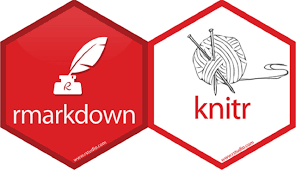
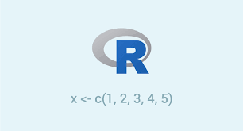
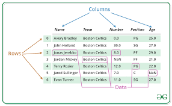
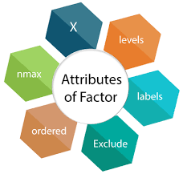
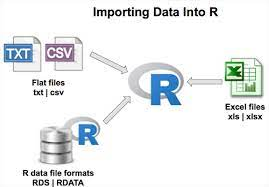

```{r load_packages, message=FALSE, warning=FALSE, include=FALSE} 
# remotes::install_github("mitchelloharawild/icons")
# devtools::install_github("ropenscilabs/icon")
# https://www.r-bloggers.com/2018/05/icon-web-icons-for-rmarkdown/

# Search icons: https://fontawesome.com/v5.15/icons
library("fontawesome")

knitr::opts_chunk$set(echo = TRUE, eval = TRUE, warning = FALSE, background = "gray85",
                      message = FALSE, fig.width=8, fig.height=6, comment = NA,
                      fig.align = 'center')

#  automatically create a bib database for R packages
knitr::write_bib(x = c(.packages(), "ggplot2"), file = "packages.bib")
```


|   |   |
|---|---|
|**Konu I: ** [R nedir](sunu\T_Temeller.html) |  |
|**Konu II: **   [R ile Raporlama](sunu\T_Dokumantasyon.html) |     |
| **Konu III: **   [Vektorler](sunu\T_Nesneler.html) |  |
| **Konu IV: **   [Veri Setleri](sunu\T_Veri_Setleri.html) |  |
| **Konu V: **   [Faktörler](sunu\T_Faktorler.html) |  |
| **Konu VI: **   [Veri Aktarma](sunu\T_Veri_Aktarim.html) |  |


