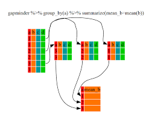
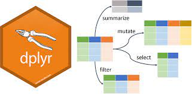
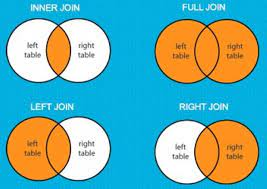
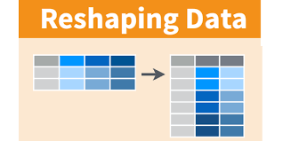

```{r load_packages, message=FALSE, warning=FALSE, include=FALSE} 
# remotes::install_github("mitchelloharawild/icons")
# devtools::install_github("ropenscilabs/icon")
# https://www.r-bloggers.com/2018/05/icon-web-icons-for-rmarkdown/

# Search icons: https://fontawesome.com/v5.15/icons
library("fontawesome")

knitr::opts_chunk$set(echo = TRUE, eval = TRUE, warning = FALSE, background = "gray85",
                      message = FALSE, fig.width=8, fig.height=6, comment = NA,
                      fig.align = 'center')

#  automatically create a bib database for R packages
knitr::write_bib(x = c(.packages(), "ggplot2"), file = "packages.bib")

```


|   |   |
|---|---|
|**Konu I: ** [dplyr paket tanıtımı](sunu\V_Veri_Duzenleme_I.html) |  |
|**Konu II: ** [Veriyi üst düzeyde toplama](sunu\V_Veri_Duzenleme_II.html) |  |
|**Konu III: ** [Seçme ve Dönüşturme](sunu\V_Veri_Duzenleme_III.html) |  |
|**Konu IV: ** [Veri Setlerini Birleştirme](sunu\V_Veri_Duzenleme_IV.html) |  |
|**Konu V: ** [Veri Formatı Degiştirme](sunu\V_Veri_Duzenleme_V.html) |  |


# Veri Setleri


- Türkiye Uluslararası Eğitim Verisi **(tuev)** geniş kapsamlı uluslararası başarı değerlendirme programlarından **PISA** ve **TIMSS** Türkiye verilerini depolayan bir R kütüphanesidir. 

- Bu eğitimde 
  - **PISA 2018** (OECD, 2019) <br>      
  - **TIMSS 2019** (Mullis, Martin, Foy, Kelly, & Fishbein; 2020) <br>  
veri setleri kullanılacaktır. 

 
PISA 2018 Bu verilerin toplandığı anketler

   - [Ogrenci Anketi](Kaynaklar/PISA_anketler/Turkish (Turkey) For Student_Questionnaire_Booklet_2018.pdf)
   - [Okul Anketi](Kaynaklar/PISA_anketler/Turkish (Turkey) For School_Questionnaire_2018.pdf)

TIMSS 2019 Grade4 Bu verilerin toplandığı anketler

   - [T19_G4_CurriculumQ](Kaynaklar/TIMSS_anketler/questionnaires_4/T19_G4_CurriculumQ.pdf)
   - [T19_SchQ_4](Kaynaklar/TIMSS_anketler/questionnaires_4/T19_SchQ_4.pdf)
   - [T19_TQ_4](Kaynaklar/TIMSS_anketler/questionnaires_4/T19_TQ_4.pdf)
   - [eT19_StuQ_4](Kaynaklar/TIMSS_anketler/questionnaires_4/eT19_StuQ_4.pdf)
   - [T19_HQ_4](Kaynaklar/TIMSS_anketler/questionnaires_4/T19_HQ_4.pdf)
   - [T19_StuQ_4](Kaynaklar/TIMSS_anketler/questionnaires_4/T19_StuQ_4.pdf)


TIMSS 2019 Grade8 Bu verilerin toplandığı anketler

   - [T19_G8_CurriculumQ](Kaynaklar/TIMSS_anketler/questionnaires_8/T19_G8_CurriculumQ.pdf)
   - [T19_SchQ_8](Kaynaklar/TIMSS_anketler/questionnaires_4/T19_SchQ_8.pdf)
   - [T19_TQS_8](Kaynaklar/TIMSS_anketler/questionnaires_4/T19_TQS_8.pdf)
   - [T19_TQM_8](Kaynaklar/TIMSS_anketler/questionnaires_4/T19_TQM_8.pdf)
   - [eT19_StuQ_8](Kaynaklar/TIMSS_anketler/questionnaires_4/eT19_StuQ_8.pdf)
   - [T19_StuQ_SepSc_8](Kaynaklar/TIMSS_anketler/questionnaires_4/T19_StuQ_SepSc_8.pdf)
   - [T19_StuQ_IntSc_8](Kaynaklar/TIMSS_anketler/questionnaires_4/T19_StuQ_IntSc_8.pdf)


