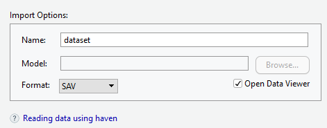

## Veri Okuma


- Veri girişi istatistiksel analiz surecinin ilk adımıdır.

--

- R'da veri girişi diğer yazılımlarla kıyaslandığında çok kullanışlı değildir. 

--

- Bu nedenle aktarma/import yolu tercih edilir.

--

- Veri aktarımı için çok sayıda fonksiyon ve paket bulunmaktadır. 

--

- Ayrıca menü ile de aktarma yapılabilir. 

--

- Bilgisayardan internetten farklı formattaki veriler okunabilir.

---

# Veri Aktarımı
  
- Veri setleri genellikle Excel, SPSS veya metin dosyaları (.txt, .csv, .dat, vb.) gibi uygun veri biçimlerinde kaydedilir


- R, çeşitli veri formatlarını içe aktarabilir (yani okuyabilir).

--

Bir veri setini R'ye aktarmanın iki yolu vardır:

--

1. RStudio'da "Veri Kümesini İçe Aktar" menü seçeneğini kullanarak
2. Belirli bir R komutunu kullanarak

<br/>

---
## Yöntem 1: RStudio'yu Kullanma

  

---
### Excel dosylarını içe aktarma

* İçe aktarmak istediğiniz dosyaya göz atın.

* Veri seti için bir isim verin. 

* İçe aktarılacak sayfayı seçin.

* Değişken isimleri dosyanın ilk satırındaysa "First Row as Names".


---
### SPSS dosylarını içe aktarma

* İçe aktarmak istediğiniz dosyaya göz atın.

* Veri seti için bir isim verin. 



<br/>

---
## Veri Okuma

-   En temel veri okuma/aktarma fonksiyonlari

--

    -   `scan()`
    
--

    -   `read.*`
    
--

    -   `read.table()`
    
--

    -   `read.csv()`
    
--

    -   `read.csv2()`
    
--

    -   `read.delim()`
    
--

    -   `read.delim2()`
    
--

    -   `readLines()`
    
---
## Veri Okuma


--

-   Verinin düzgün girilmiş olması okumayı kolaylaştırır.

--

-   İlk satırda genellikle değişken adlarına (header), 
ilk sütunda ise kimlik veya sıra numarasına yer verilir.

--

-   Gözlemlere ve değişkenlere ilişkin veri girilirken karakterler veya 
sayısal değerler arasında boşluk bırakmaktan kaçınmak gerekmektedir.

--

-   Değişken adı boşluklu yazılmışsa ne olur?

---
## Veri Okuma

--


-   Eksik veri boyunca aynı şekilde girilmelidir.

--


-   Değişkenlerin birinden nasıl ayrıldığı önemlidir. (, ; : \ / )

--


-   Tercihimiz **.csv** uzantılı veriler ama büyük veri setleri az yer kalması icin **.txt,.prn** formatında karşımıza çıkabilmektedir.

---
### Komutlarla veri aktarma
  
- Temel pakette **read.csv** ve **read.table** gibi bazı fonksiyonlar bulunmaktadır.

- Ayrıca, belirli  formatlarını içe aktarmak için R paketleri bulunmaktadır.

- Örneğin, SPSS dosyaları için **foreign** ve Excel dosyaları için **xlsx** gibi

---

## read.\*() fonksiyonlari
|  **Argüman**  &nbsp;&nbsp;&nbsp;&nbsp;	|   **Açıklama**	|
|:---	|:---	|
|  **header** &nbsp;&nbsp;&nbsp;&nbsp; 	|  Mantıksal değerler ile verinin ilk satırında değişken isimlerinin olup olmadığını test eder. 	|
|  **sep**  	&nbsp;&nbsp;&nbsp;&nbsp;  |  Sütun ayracıdır.  	|
|   **na.strings** &nbsp;&nbsp;&nbsp;&nbsp;	|  Kayıp değerleri belirtmek için kullanılır.  	|
|   **dec**	&nbsp;&nbsp;&nbsp;&nbsp;  |  Ondalık sayıların ne ile ayrıldığını gösteren argümandır.  	|
|   **nrows** &nbsp;&nbsp;&nbsp;&nbsp; 	|  Okunmak istenilen satır sayısını belirtmek için kullanılır.  	|
|   **skip**  &nbsp;&nbsp;&nbsp;&nbsp;	|  Bir dosya okunurken okunmadan atlanmak istenilen satır sayısı için kullanılır.  |


---
## Importing Excel files
  
```{r  eval=FALSE}
# yükle ve aktive et 
install.packages("xlsx")
library("xlsx")

# read.xlsx fonksiyonunun kullanımı
my_excel_file <- read.xlsx("dizin/dosyaadi.xlsx",
                 sheetName = "sheetname")
```    

---
### SPSS dosyası aktarma
  
```{r eval=FALSE}
# yükle ve aktive et 
install.packages("foreign")
library("foreign")

# read.spss fonksiyonunun kullanımı
my_spss_file <- read.spss("dizin/dosyaadi.sav",
                to.data.frame = TRUE)
```


---
### text dosyası aktarma

- text dosyaları okumak için paket yüklemeye gerek yoktur.  
```{r  eval=FALSE}
# , ile ayrılmış csv dosyaları
csv_dosya <- read.csv("dizin/dosyaadi.csv", 
                      header = TRUE)

# tab ile ayrılmış txt dosyaları
txt_dosya <- read.table("dizin/dosyaadi.txt", h
                        header = TRUE, sep = "\t")
```

- Dikkat
  
- `header = TRUE` 
- `sep="\t"` 
- `sep=","` for comma-separated files

---
## Uygulama

- `r emo::ji('link')`[veri1.txt](import/veri1.txt)
- `r emo::ji('link')`[veri1.csv](import/veri1.csv)
- `r emo::ji('link')`[verifwf.txt](import/fwf.txt)
- `r emo::ji('link')`[factor.sav](import/factor.sav)
- `r emo::ji('link')`
[https://www.statmodel.com/usersguide/chap3/ex3.1.dat](https://www.statmodel.com/usersguide/chap3/ex3.1.dat)

---
## Uygulama

```{r eval=FALSE, include=FALSE}
veritxt <- read.table("veri1.txt", header=TRUE, sep=";", dec=",")
veritxt

vericsv <- read.csv("veri1.csv",dec=",")
vericsv

vericsv_1<- read.csv("veri1.csv", 
row.names=c("001", "002", "003", "004"),
col.names=c("No", "M1", "M2", "M3", "M4", "M5"))
vericsv_1

vericsv_2 <- read.csv("veri1.csv",  
          row.names=c("001", "002", "003","004"),       
          col.names=c("No", "M1", "M2", "M3", "M4", "M5"))[,-1]
vericsv_2


verifwf <- read.fwf("import/fwf.txt", 
   widths=c(1, 3, 1, 1, 1, 1, 1, 1, 1, 1, 1, 1, 1))
head(verifwf,3)

verifwf <- read.fwf("fwf.txt", 
widths=c(1, 3, 1, 1, 1, 1, 1, 1, 1, 1, 1, 1, 1), 
col.names=c("sira", "no", "kitapcik", 
            "m1", "m2", "m3", "m4", "m5",  
            "m6", "m7", "m8", "m9", "m10"))
head(verifwf,3)

ex3_1 <- scan("https://www.statmodel.com/usersguide/chap3/ex3.1.dat", 
              what=list(y1=0, x1=0, x3=0))
# y1 değişkeni için ilk 10 bireye ilişkin verinin head() fonksiyonu ile 
# göterilmesi
head(ex3_1$y1, n = 10)
sonuc <- readLines("https://www.statmodel.com/usersguide/chap5/ex5.1.html ")
sonuc[1:10]

factor <- haven::read_sav("factor.sav")
str(factor)
```

---
## Veri Yazma

```{r}
ad  <-  c("Ali","Elif","Su","Deniz","Aras","Berk","Can","Ece","Efe","Arda")
boy <- c(160,165,170,155,167,162,169,158,160,164)
kilo <- c(50,55,57,50,48,65,58,62,45,47)
beden <- c("S","M","S","M","S","L","M","L","S","S")
df <- data.frame(ad, boy, kilo, beden)
df

```

---

## write.table 

--

```{r eval=FALSE}
write.table(df, file="df.txt")# df dosyasi nerede, gorunumu nasil

```

--

```{r eval=FALSE}
write.table(df, file="df.txt",row.names = FALSE,col.names = FALSE)
# karakter nesnler tirnak icinde ne yapmali?
```

--

```{r}
write.table(df, file="df.txt",row.names = FALSE,col.names = FALSE,quote=FALSE)
```

---

## write.table 

yeni gözlem eklemek istiyorsaniz append argümanı kullanılabilir.

```{r}
 ek <- data.frame(ad=c("Ahmet","Ali"), boy=c(180,170), kilo=c(60,70), 
                 beden=c("S","L"))
```

--

```{r eval=FALSE}
write.table(ek, "df.txt",row.names=FALSE,
            col.names=FALSE,
            quote=FALSE,append=TRUE)

```

---

## write.csv

**write.csv()** fonksiyonu kullanılarak yazılan veri dosyaları "," ile,   **write.csv2()**  fonksiyonu kullanılarak yazılan veri dosyaları ise ";" ile ayrılır  iki fonksiyonun bir diğer farkı ise ondalık sayı ayıracıdır.

--

 write.csv ile yazdırılan dosyaların excelde açılması


---

## cat

**cat()** fonksiyonu

- Döngülerde sıklıkla ekrana bilgi yazdırmak amacıyla kullanılır, ancak dosya yazdırmak amacıyla da kullanabilmektedir. 
- fonksiyonlarla yapılan hesaplama çıktısı da yazabilmektedir. 
- Bu nedenle bir R oturumu sırasında not alınmak istenilen bilgileri bir dosyaya yazdırmak için kullanılabilir.

```{r eval=FALSE}
 cat("ogrencilerin boy ortalamasi ", mean(boy), "\n",
      "ogrencilerin kilo ortalamasi", mean(kilo), "\n",
     file="bilgi.txt")
```
 **"\n" ne ise yaradi?**
 
---
## writeLines fonksiyonu
```{r}
writeLines("ogrencilerin boy ortalamasi: 163 cm\n",
            "ogrencilerin kilo ortalamasi: 53.7 kg",
            con="bilgi2.txt")
 
```

 
---
 
## sink() fonksiyonu

- **sink()**  fonksiyonu yapılan işlemlerin çıktısını R konsola değil belirtilen dosyaya yazmaktadır. Bu fonksiyon özellikle uzun komut dosyalarında hata ayıklamak için 
ve belirli hesaplamaların bir dökumana yazılmak istediğinde bu işlemleri bir nesneye atamadan yapabilmektedir. Asıl amacı komutların çalışmasını hızlandırmaktadır.
- Çalışma alanını temizleyerek aşağıdaki kod satırlarını çalıştıralım.

```{r eval=FALSE}
 # Baglanti kurulmasi
 sink("sinktest.txt")
 
 # Islem yapilmasi
 x <- matrix(rnorm(16),4,4)
 y <- matrix(rnorm(16),4,4)
 x %*% y # sonuc konsolda gorunmez
 # islemin dosyaya yazdirilip kapatilmasi
 sink()
```

---

## dump() fonksiyonu
- **dump()** fonksiyonu ile bir R oturumu sırasında kullanmak istenmeyen nesneler bir dosyaya yazdırabilir. 
- Bu sayede çalışma alanında yer kaplamazlar ve tekrar kullanılmak istenildiğinde **source()** fonksiyonu ile kullanılabilirler.
```{r}
 # x ve y nesnelerinin olusturulmasi
 x<-matrix(rnorm(16),4,4)
 y<-matrix(rnorm(16),4,4)
 
 # Bu nesnelerin metin seklinde bir dosyaya yazdirilmasi
 dump(c("x","y"), file="dumptest.txt")
```
- çalışma alanının temizlenmeyerek, **source()** fonksiyonu ile dosya çalıştırıldığında nesneler tekrar çalışma alanına gelir.

```{r}
 source("dumptest.txt")
```


---

## dput() ve dget() fonksiyonlar?

- **dput()** fonksiyonunu ile saklanan nesneler  **dget()** fonksiyonu ile tekrar çalışma alanına getirilebilir ve yeni bir nesneye atanabilir. 


- **dump()** fonksiyonu nesneyi aynı işlemle çalışma alanına getirirken,


- **dget()** fonksiyonu ise nesnenin içeriğini yazdırır

- nesneyi  çalışma alanına kaydetmek için nesneye yeni bir ad vermek gerekmektedir.

 
--

```{r}
 # df nesnesinin dput() fonksiyonu ile dosyaya yazdirilmasi
 dput(df, file="dput.txt")
 #  calisma alaninin temizlenmesi
 rm(list=ls())
 # Veri setinin tekrar  calisma alanina getirilmesi
 yeni <- dget("dput.txt")
 yeni 
```
 
--


---

# file() fonksiyonlari

```{r}
 
 deneme<-file("deneme.txt", open="w")
 
 # Dosyaya belirli satirlarin eklenmesi 
 cat("Bu bir denemedir\n\n", file=deneme)
 
 # Dosyaya yazdirilmak istenilen nesnenin olusturulmasi
 matris1<-matrix(round(rnorm(12),4), ncol=3)
 
 # Nesnenin yazdirilmasi
 write.table(matris1, file=deneme, row.names=FALSE, col.names=FALSE)
 
 # kapatma
 close(deneme)
 
 # Ayni dosyaya tekrar ekleme yapilmasi
 matris2<-matrix(round(rnorm(12),4), ncol=3)
 write.table(matris2, file="deneme.txt", 
             row.names=FALSE,  col.names=FALSE, append=TRUE)
```
 

---
.center[

.large[.hand[Teşekkürler..]]


`r emo::ji('coffee')` 
]


