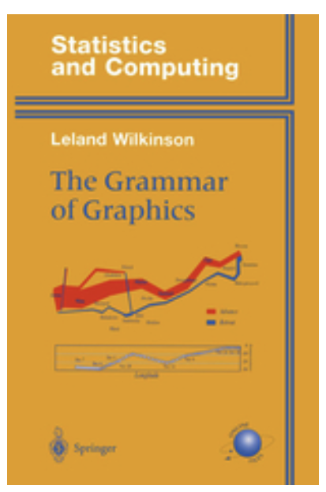
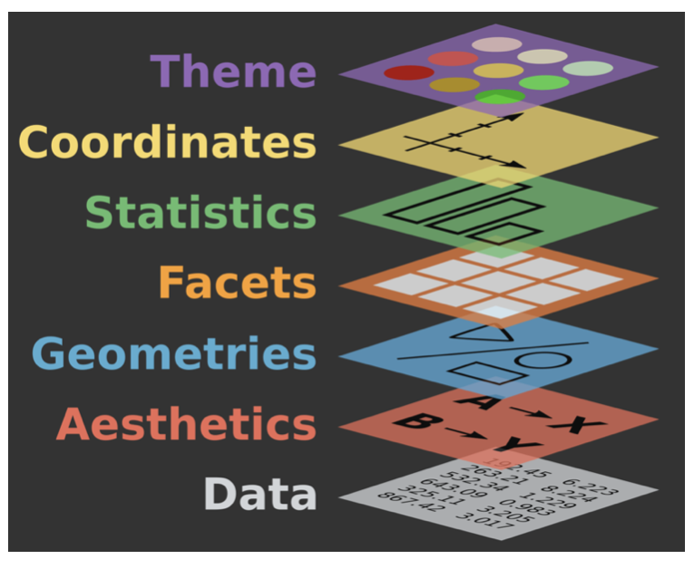

```{r set-theme, include=FALSE}
library(xaringanthemer)
style_duo_accent(
  primary_color      = "#0F4C81", # pantone classic blue
  secondary_color    = "#B6CADA", # pantone baby blue
  header_font_google = google_font("Raleway"),
  text_font_google   = google_font("Raleway", "300", "300i"),
  code_font_google   = google_font("Source Code Pro"),
  text_font_size     = "30px"
)
```


```{r load-packages, include=FALSE, message=FALSE, warning=FALSE}
library(tidyverse)
library(dplyr)
library(tidyr)

library(tuev)


```


```{r packages, echo=FALSE, message=FALSE, warning=FALSE}
library(tidyverse)
library(palmerpenguins)
```

class: middle

# Grafikler

---

# Grafikler

> *"The simple graph has brought more information to the data analyst's mind than any other device." --- John Tukey*

- Veri görselleştirme, verilerin görsel temsilinin oluşturulması ve incelenmesidir.

- Verileri görselleştirmek için birçok araç bulunmaktadır.

- Veri görselleştirmeleri için R içindeki birçok yaklaşım/sistem - **ggplot2** bunlardan biridir.

---

## Kitap Önerisi?

.pull-left[
- Tüm istatistiksel grafiklerin altında yatan temel özellikleri açıklar
- Leland Wilkinson 
]
.pull-right[
```{r echo=FALSE, out.width="60%"}

```
]

---

## Gözden Geçirme

.pull-left[
- Grafik **map**s  
 - **data** 
 - **aes**thetic attributes (colour, shape, size) of 
 - **geom**etric shapes (points, lines, bars)
 
- Plot may also include **stat**istical transformations of the data,  information about the **coord**inate system, and the **theme**

- **Facet**ting can be used to plot for different subsets of the data

]
.pull-right[
```{r echo=FALSE, out.width="100%"}

```
]

.footnote[
.small[
Sources: [ggplot2: Elegant Graphics for Data Analysis](https://ggplot2-book.org/introduction.html) and [BloggoType](http://bloggotype.blogspot.com/2016/08/holiday-notes2-grammar-of-graphics.html)
]
]

---

## Grafik Elemanları

- Tüm grafikler

  - the **data**: görselleştimek istenilen veri

  - a **mapping**: veri değişkenlerinin estetik niteliklerle nasıl eşleştirildiğinin açıklaması

---

## Mapping 


- **katman**: **geom**metrik öğelerin koleksiyonu (grafik elemanları: noktalar, çizgiler, çokgenler vb.) ve istatistiksel dönüşümler (**istatistikler**) (ör. frekans) histogram oluşturmak veya doğrusal bir modele uyumu göstermek)


--

- **scales**: Veri alanındaki değerlerin **aes**thetic alandaki değerlerle (ör. renk, şekil, boyut kullanımı) ve ayrıca orijinal veri değerlerinin grafikten okunmasını mümkün kılmak için ters eşlemeyle (ör. etiketler, eksenler vb.) eşlenmesi )
--

- **coord**inate system: Veri koordinatlarının grafik düzlemine eşlenmesi ve grafiğin okunmasına yardımcı olacak eksenler ve kılavuz çizgileri sağlar(e.g. Cartesian, polar, map projections, vb)

--

- **facet**: Veri alt kümelerinin yüzeylere olarak nasıl ayrılacağını belirtir

--

- **theme**: Ekranın daha ince noktalarını kontrol eder (ör. yazı tipi boyutu, arka plan rengi) ve özelleştirilebilir.

---


## Ağırlık vs. Uzunluk

```{r mass-height, out.width = "50%"}
ggplot(data = starwars, mapping = aes(x = height, y = mass)) +
  geom_point() +
  labs(title = "Starwars karakterlerinin ağırlık ve uzunluğu",
       x = "Uzunluğu (cm)", y = "Ağırlık (kg)")
```

---

.question[ 
- Çizimi yapan fonksiyonlar nelerdir?
- Çizilen veri kümesi nedir?
- Hangi değişkenler olay örgüsünün hangi özelliklerine (estetik) eşlenir?
- Uyarı ne anlama geliyor?<sup>+</sup>
]

```{r ref.label="mass-height", fig.show = "hide"}
```

.footnote[
<sup>+</sup>Sonraki sayfalarda uyarı notu kod bloğundan çıkarılmıştır
]

---

## ggplot2 $\in$ tidyverse

.pull-left[
- "ggplot2" içindeki "gg", Grafik Grameri anlamına gelir.
- **grafiklerin gramerine** dayalı olarak oluşturulmuştur
- **ggplot2**,tidyverse'in veri görselleştirme paketidir

```{r eval=FALSE}
library(tidyverse)

# or
library(ggplot2)
```
] 
.pull-right[ 
```{r echo=FALSE, out.width="80%"}
knitr::include_graphics("figs/ggplot2-part-of-tidyverse.png")
```
]

---

## ggplot2!

- `ggplot()`  ggplot2 paketinin temel fonksiyonudur
- Grafikler katmanlar olarak inşa edilir.
- kodun genel yapısı

```{r eval = FALSE}
ggplot(data = [dataset], 
       mapping = aes(x = [x-variable], y = [y-variable])) +
   geom_xxx() +
   other options
```

---

class: middle

# ggplot2 `r emo::ji("heart")` `r emo::ji("penguin")`

---

## Data: Palmer Penguins

-  Palmer Archipelago adasındaki Penguen türlerinin ölçümleri (yüzgeç uzunluğu, vücut kütlesi, gaga boyutları) ve cinsiyet bilgilerini içermektedir.

.pull-left-narrow[
```{r echo=FALSE, out.width="80%"}
knitr::include_graphics("figs/penguins.png")
```
]
.pull-right-wide[
```{r}
library(palmerpenguins)
glimpse(penguins)
```
]

---

.panelset[
.panel[.panel-name[Grafik]
```{r ref.label = "penguins", echo = FALSE, warning = FALSE, out.width = "70%", fig.width = 8}
```
]
.panel[.panel-name[Kod]
```{r penguins, fig.show = "hide"}
ggplot(data = penguins, 
       mapping = aes(x = bill_depth_mm, y = bill_length_mm,
                     colour = species)) +
  geom_point() +
  labs(title = "Gaga derinliği ve uzunluğu",
       subtitle = "Adelie, Chinstrap, and Gentoo Penguenleri için Ölçüler",
       x = "Gaga derinliği(mm)", y = "Gaga uzunluğu (mm)",
       colour = "Türler")
```
]
]

---

class: middle

# Aşama aşama grafik çizimi

---

.midi[
> **`penguins` veri seti ile başlayalım**
]

.pull-left[
```{r penguins-0, fig.show = "hide", warning = FALSE}
ggplot(data = penguins) #<<
```
]
.pull-right[
```{r ref.label = "penguins-0", echo = FALSE, warning = FALSE, out.width = "100%", fig.width = 8}
```
]

---

.midi[
> **`penguins` veri seti ile başlayın**   
> **x-eksenine gaga derinlğini yerleştirelim.**  
]

.pull-left[
```{r penguins-1, fig.show = "hide", warning = FALSE}
ggplot(data = penguins,
       mapping = aes(x = bill_depth_mm)) #<<
```
]
.pull-right[
```{r ref.label = "penguins-1", echo = FALSE, warning = FALSE, out.width = "100%", fig.width = 8}
```
]

---

.midi[
> **`penguins` veri seti ile başlayalım**   
> **x-eksenine gaga derinlğini yerleştirelim.**  
> **y-eksenine de gaga uzunluğunu**  
]

.pull-left[
```{r penguins-2, fig.show = "hide", warning = FALSE}
ggplot(data = penguins,
       mapping = aes(x = bill_depth_mm,
                     y = bill_length_mm)) #<<
```
]
.pull-right[
```{r ref.label = "penguins-2", echo = FALSE, warning = FALSE, out.width = "100%", fig.width = 8}
```
]

---

.midi[
> **`penguins` veri seti ile başlayalım**  
> **x-eksenine gaga derinlğini yerleştirelim.**  
> **y-eksenine de gaga uzunluğunu**   
> **grafik türü ise saçılım grafiği olsun**  
]

.pull-left[
```{r penguins-3, fig.show = "hide", warning = FALSE}
ggplot(data = penguins,
       mapping = aes(x = bill_depth_mm,
                     y = bill_length_mm)) + 
  geom_point() #<<
```
]
.pull-right[
```{r ref.label = "penguins-3", echo = FALSE, warning = FALSE, out.width = "100%", fig.width = 8}
```
]

---

.midi[
> **`penguins` veri seti ile başlayalım**   
> **x-eksenine gaga derinlğini yerleştirelim.**  
> **y-eksenine de gaga uzunluğunu**     
> **grafik türü ise saçılım grafiği olsun**  
> **her bir türü ayrı renk ile belirtelim.**  
]

.pull-left[
```{r penguins-4, fig.show = "hide", warning = FALSE}
ggplot(data = penguins,
       mapping = aes(x = bill_depth_mm,
                     y = bill_length_mm,
                     colour = species)) + #<<
  geom_point()
```
]
.pull-right[
```{r ref.label = "penguins-4", echo = FALSE, warning = FALSE, out.width = "100%", fig.width = 8}
```
]

---

.midi[
> **`penguins` veri seti ile başlayalım**  
> **x-eksenine gaga derinlğini yerleştirelim.**   
> **y-eksenine de gaga uzunluğunu**   
> **grafik türü ise saçılım grafiği olsun**    
> **her bir türü ayrı renk ile belirtelim.**  
> **Başlık ekleyelim "Gaga derinlik ve uzunluğu"**   
]

.pull-left[
```{r penguins-5, fig.show = "hide", warning = FALSE}
ggplot(data = penguins,
       mapping = aes(x = bill_depth_mm,
                     y = bill_length_mm,
                     colour = species)) +
  geom_point() +
  labs(title = "Gaga derinlik ve uzunluğu") #<<
```
]
.pull-right[
```{r ref.label = "penguins-5", echo = FALSE, warning = FALSE, out.width = "100%", fig.width = 8}
```
]

---

.midi[
> **`penguins` veri seti ile başlayalım**    
> **x-eksenine gaga derinlğini yerleştirelim.**  
> **y-eksenine de gaga uzunluğunu**  
> **grafik türü ise saçılım grafiği olsun**  
> **her bir türü ayrı renk ile belirtelim.**  
> **Başlık ekleyelim "Gaga derinlik ve uzunluğu"**  
> **Alt başlık "Adelie, Chinstrap, and Gentoo Penguen Türleri için Boyutlar"**
]

.pull-left[
```{r penguins-6, fig.show = "hide", warning = FALSE}
ggplot(data = penguins,
       mapping = aes(x = bill_depth_mm,
                     y = bill_length_mm,
                     colour = species)) +
  geom_point() +
  labs(title = "Gaga derinlik ve uzunluğu",
       subtitle = "Adelie, Chinstrap, and Gentoo Penguen Türleri için Boyutlar") #<<
```
]
.pull-right[
```{r ref.label = "penguins-6", echo = FALSE, warning = FALSE, out.width = "100%", fig.width = 8}
```
]

---

.midi[
> ** x and y Eksen isimleri  "Gaga derinliği (mm)" and "Gaga uzunluğu (mm)"**
]

.pull-left[
```{r penguins-7, fig.show = "hide", warning = FALSE}
ggplot(data = penguins,
       mapping = aes(x = bill_depth_mm,
                     y = bill_length_mm,
                     colour = species)) +
  geom_point() +
  labs(title = "Gaga derinlik ve uzunluğu",
       subtitle = "Adelie, Chinstrap, and Gentoo Penguen Türleri için Boyutlar",
       x = "Gaga derinliği (mm)", y = "Gaga uzunluğu  (mm)") #<<
```
]
.pull-right[
```{r ref.label = "penguins-7", echo = FALSE, warning = FALSE, out.width = "100%", fig.width = 8}
```
]

---

.midi[
> ** x and y Eksen isimleri  "Gaga derinliği (mm)" and "Gaga uzunluğu (mm)"**  
> **Etiket ekle "Türler"**  
]

.pull-left[
```{r penguins-8, fig.show = "hide", warning = FALSE}
ggplot(data = penguins,
       mapping = aes(x = bill_depth_mm,
                     y = bill_length_mm,
                     colour = species)) +
  geom_point() +
  labs(title = "Bill depth and length",
       subtitle = "Dimensions for Adelie, Chinstrap, and Gentoo Penguins",
       x = "Bill depth (mm)", y = "Bill length (mm)",
       colour = "Species") #<<
```
]
.pull-right[
```{r ref.label = "penguins-8", echo = FALSE, warning = FALSE, out.width = "100%", fig.width = 8}
```
]

---

.midi[
> **Etiket ekle "Türler"**  
> **Data kaynağı için bilgi eklenebilir. **
]

.pull-left[
```{r penguins-9, fig.show = "hide", warning = FALSE}
ggplot(data = penguins,
       mapping = aes(x = bill_depth_mm,
                     y = bill_length_mm,
                     colour = species)) +
  geom_point() +
  labs(title = "Gaga derinlik ve uzunluğu",
       subtitle = "Adelie, Chinstrap, and Gentoo Penguen Türleri için Boyutlar",
       x = "Gaga derinliği (mm)", y = "Gaga uzunluğu  (mm)",
       colour = "Species",
       caption = "Kaynak: Palmer Station LTER / palmerpenguins paketinden") #<<
```
]
.pull-right[
```{r ref.label = "penguins-9", echo = FALSE, warning = FALSE, out.width = "100%", fig.width = 8}
```
]

---

.midi[
> **Son olarak,  renk körlüğü sahip bireyler tarafından algılanmak üzere tasarlanmış ayrı bir renk skalası kullanın.**
]

.pull-left[
```{r penguins-10, fig.show = "hide", warning = FALSE}
ggplot(data = penguins,
       mapping = aes(x = bill_depth_mm,
                     y = bill_length_mm,
                     colour = species)) +
  geom_point() +
  labs(title = "Gaga derinlik ve uzunluğu",
       subtitle = "Adelie, Chinstrap, and Gentoo Penguen Türleri için Boyutlar",
       x = "Gaga derinliği (mm)", y = "Gaga uzunluğu  (mm)",
       colour = "Species",
       caption = "Kaynak: Palmer Station LTER / palmerpenguins paketinden") +
  scale_colour_viridis_d() #<<
```
]
.pull-right[
```{r ref.label = "penguins-10", echo = FALSE, warning = FALSE, out.width = "100%", fig.width = 8}
```
]

---

.panelset[
.panel[.panel-name[Grafik]
```{r ref.label="penguins-10-nohighlight", echo = FALSE, warning = FALSE, out.width = "70%", fig.width = 8}
```
]
.panel[.panel-name[Kod]

```{r penguins-10-nohighlight, fig.show = "hide"}
ggplot(data = penguins,
       mapping = aes(x = bill_depth_mm,
                     y = bill_length_mm,
                     colour = species)) +
  geom_point() +
  labs(title = "Gaga derinlik ve uzunluğu",
       subtitle = "Adelie, Chinstrap, and Gentoo Penguen Türleri için Boyutlar",
       x = "Gaga derinliği (mm)", y = "Gaga uzunluğu  (mm)",
       colour = "Species",
       caption = "Kaynak: Palmer Station LTER / palmerpenguins paketinden") +
  scale_colour_viridis_d()
```
]
.panel[.panel-name[Özet]
.pull-left-wide[
.midi[
> **`penguins` veri seti ile başlayalım**  
> **x-eksenine gaga derinlğini yerleştirelim.**  
> **y-eksenine de gaga uzunluğunu**   
> **grafik türü ise saçılım grafiği olsun**  
> **her bir türü ayrı renk ile belirtelim.**  
> **Başlık ekleyelim "Gaga derinlik ve uzunluğu"**  
> **Alt başlık "Adelie, Chinstrap, and Gentoo Penguin Türleri için **   
> ** x and y Eksen isimleri  "Gaga derinliği (mm)" and "Gaga uzunluğu (mm)"**
> **Etiket ekle "Türler"**  
> **Data kaynağı için bilgi eklenebilir. **  
> **Renk körlüğü için özel renk skalası eklendi**
]
]
]
]

---

## Argüman adları

.tip[
**ggplot()** ile çizimler oluştururken ilk iki argüman adını atlayabilirsiniz..
]

.pull-left[
```{r named-args, eval = FALSE}
ggplot(data = penguins,
       mapping = aes(x = bill_depth_mm,
                     y = bill_length_mm,
                     colour = species)) +
  geom_point() +
  scale_colour_viridis_d()
```
]
.pull-right[
```{r not-named-args, eval = FALSE}
ggplot(penguins,
       aes(x = bill_depth_mm,
           y = bill_length_mm,
           colour = species)) +
  geom_point() +
  scale_colour_viridis_d()
```
]

---

class: middle

# Aesthetics

---

## Aesthetics seçenekleri

Verilerde **belirli bir değişkenle eşlenebilen** çizim karakterlerinin yaygın olarak kullanılan özellikleri şunlardır:
- `colour`
- `shape`
- `size`
- `alpha` (transparency)

---

## Colour

.pull-left[
```{r colour, fig.show = "hide", warning = FALSE}
ggplot(penguins,
       aes(x = bill_depth_mm, 
           y = bill_length_mm,
           colour = species)) + #<<
  geom_point() +
  scale_colour_viridis_d()
```
]
.pull-right[
```{r ref.label = "colour", echo = FALSE, warning = FALSE, out.width = "100%"}
```
]

---

## Shape

"renk" değişkeninden farklı bir değişkenle eşlendi

.pull-left[
```{r shape-island, fig.show = "hide", warning = FALSE}
ggplot(penguins,
       aes(x = bill_depth_mm, 
           y = bill_length_mm,
           colour = species,
           shape = island)) + #<<
  geom_point() +
  scale_colour_viridis_d()
```
]
.pull-right[
```{r ref.label = "shape-island", echo = FALSE, warning = FALSE, out.width = "100%"}
```
]

---

## Shape

"renk" ile aynı değişkene eşlendi

.pull-left[
```{r shape-species, fig.show = "hide", warning = FALSE}
ggplot(penguins,
       aes(x = bill_depth_mm, 
           y = bill_length_mm,
           colour = species,
           shape = species)) + #<<
  geom_point() +
  scale_colour_viridis_d()
```
]
.pull-right[
```{r ref.label = "shape-species", echo = FALSE, warning = FALSE, out.width = "100%"}
```
]

---

## Size

.pull-left[
```{r size, fig.show = "hide", warning = FALSE}
ggplot(penguins,
       aes(x = bill_depth_mm, 
           y = bill_length_mm,
           colour = species,
           shape = species,
           size = body_mass_g)) + #<<
  geom_point() +
  scale_colour_viridis_d()
```
]
.pull-right[
```{r ref.label = "size", echo = FALSE, warning = FALSE, out.width = "100%"}
```
]

---

## Alpha

.pull-left[
```{r alpha, fig.show = "hide", warning = FALSE}
ggplot(penguins,
       aes(x = bill_depth_mm, 
           y = bill_length_mm,
           colour = species,
           shape = species,
           size = body_mass_g,
           alpha = flipper_length_mm)) + #<<
  geom_point() +
  scale_colour_viridis_d()
```
]
.pull-right[
```{r ref.label = "alpha", echo = FALSE, warning = FALSE, out.width = "100%"}
```
]

---

.pull-left[
**Mapping**

```{r warning = FALSE, out.width = "100%"}
ggplot(penguins,
       aes(x = bill_depth_mm,
           y = bill_length_mm,
           size = body_mass_g, #<<
           alpha = flipper_length_mm)) + #<<
  geom_point()
```
]
.pull-right[
**Setting**

```{r warning = FALSE, out.width = "100%"}
ggplot(penguins,
       aes(x = bill_depth_mm,
           y = bill_length_mm)) + 
  geom_point(size = 2, alpha = 0.5) #<<
```
]

---

## Mapping vs. setting

- **Mapping:** Verilerdeki bir değişkenin değerlerine göre noktaların boyutunu, saydamlığını vb. belirler.
   - "aes()" içine gider
  - `aes()`

- **Setting:** Verilerdeki bir değişkenin değerlerine göre **değil** noktaların boyutunu, saydamlığını vb. belirler
  -  `geom_*()` 
  
---

class: middle

# Geometries

---

## `geom_histogram()`

```{r out.width="50%"}
ggplot(penguins, aes(x = body_mass_g)) +
  geom_histogram()
```

---

## `geom_histogram()`

```{r out.width="50%"}
ggplot(penguins, aes(x = body_mass_g)) +
  geom_histogram(binwidth =250)
```

---

## `geom_density()`

```{r out.width="50%"}
ggplot(penguins, aes(x = body_mass_g)) +
  geom_density(color = "skyblue", fill = "skyblue", alpha = 0.2)
```

---

## `geom_density()`

```{r out.width="50%"}
ggplot(penguins, aes(x = body_mass_g, color = species, fill = species)) +
  geom_density(alpha = 0.2)
```

---

## `geom_bar()`

```{r}
ggplot(penguins, aes(x = species)) +
  geom_bar()
```

---

## `geom_bar()`

```{r}
ggplot(penguins, aes(x = island, fill = species)) +
  geom_bar()
```

---

## `geom_bar()`

```{r}
ggplot(penguins, aes(x = island, fill = species)) +
  geom_bar(position = "fill")
```

---

## `geom_bar()`

```{r}
ggplot(penguins, aes(y = island, fill = species)) +
  geom_bar(position = "fill") +
  labs(x = "proportion")
```

---

## Diğer grafik türleri için

.center[
<iframe width="900" height="450" src="https://ggplot2.tidyverse.org/reference/index.html#section-geoms" frameborder="0" style="background:white;"></iframe>  
]


---

## ggplot2 garici seçenekler

```{r out.width="40%"}
library(ggridges)
ggplot(penguins, aes(x = body_mass_g, y = species)) +
  geom_density_ridges2()
```

---

```{r}
ggplot(penguins, aes(x = body_mass_g, y = species, color = species, fill = species)) +
  geom_density_ridges2(alpha = 0.5)
```

---

```{r}
ggplot(penguins, aes(x = body_mass_g, y = species, color = species, fill = species)) +
  geom_density_ridges2(alpha = 0.5, show.legend = FALSE)
```

---

class: middle

# Facetting

---

## Facetting

- Verilerin farklı alt kümelerini gösteren daha küçük grafikler

- Koşullu ilişkileri ve büyük verileri keşfetmek için kullanışlıdır

---

.panelset[
.panel[.panel-name[Grafik]
```{r ref.label = "facet", echo = FALSE, warning = FALSE, out.width = "70%"}
```
]
.panel[.panel-name[Kod]

```{r facet, fig.show = "hide"}
ggplot(penguins, aes(x = bill_depth_mm, y = bill_length_mm)) + 
  geom_point() +
  facet_grid(species ~ island) #<<
```
]
]

---

## Yüzey Ekleme

.question[
Farklı grafik türleri inceleyerek, kod ile ilişkisini kurmanızı bekliyorum.
]

---

```{r warning = FALSE}
ggplot(penguins, aes(x = bill_depth_mm, y = bill_length_mm)) + 
  geom_point() +
  facet_grid(species ~ sex) #<<
```

---

```{r warning = FALSE}
ggplot(penguins, aes(x = bill_depth_mm, y = bill_length_mm)) + 
  geom_point() +
  facet_grid(sex ~ species) #<<
```

---

```{r warning = FALSE, fig.asp = 0.5}
ggplot(penguins, aes(x = bill_depth_mm, y = bill_length_mm)) + 
  geom_point() +
  facet_wrap(~ species) #<<
```

---

```{r warning = FALSE, fig.asp = 0.5}
ggplot(penguins, aes(x = bill_depth_mm, y = bill_length_mm)) + 
  geom_point() +
  facet_grid(. ~ species) #<<
```

---

```{r warning = FALSE}
ggplot(penguins, aes(x = bill_depth_mm, y = bill_length_mm)) + 
  geom_point() +
  facet_wrap(~ species, ncol = 2) #<<
```

---

## Yüzeyler

- `facet_grid()`:
    - 2d grid
    - `satir ~ sütun`
    -  `.` kullanımına dikkat
- `facet_wrap()`: belirtilen satir ve sütun sayına göre ayarlama yapılabilen alan tasarlar

---

## Facet and color

.pull-left-narrow[
```{r facet-color-legend, fig.show = "hide", warning = FALSE}
ggplot(
  penguins, 
  aes(x = bill_depth_mm, 
      y = bill_length_mm, 
      color = species)) + #<<
  geom_point() +
  facet_grid(species ~ sex) +
  scale_color_viridis_d() #<<
```
]
.pull-right-wide[
```{r ref.label = "facet-color-legend", echo = FALSE, warning = FALSE, out.width = "100%"}
```
]

---

## Face and color, no legend

.pull-left-narrow[
```{r facet-color-no-legend, fig.show = "hide", warning = FALSE}
ggplot(
  penguins, 
  aes(x = bill_depth_mm, 
      y = bill_length_mm, 
      color = species)) +
  geom_point(show.legend = FALSE) + #<<
  facet_grid(species ~ sex) +
  scale_color_viridis_d()
```
]
.pull-right-wide[
```{r ref.label = "facet-color-no-legend", echo = FALSE, warning = FALSE, out.width = "100%"}
```
]

---

class: middle

# Daha fazlası için

---

## Grafiklerin grameri **nedir** ve **değildir**?

- Hangi grafiklerin kullanılacağını önermez.

- Etkileşimli grafikleri tanımlamaz, yalnızca statik olanları tanımlar.

---

##  Videos

- ggplot2 workshop by Thomas Lin Pedersen:
  - [Part 1](https://www.youtube.com/watch?v=h29g21z0a68)
  - [Part 2](https://www.youtube.com/watch?v=0m4yywqNPVY)

- Kara Woo - [Always look on the bright side of plots](https://www.youtube.com/watch?v=izV-qK3nlhA&ab_channel=RStudio) (rstudio::global(2021))

- Athanasia Monika Mowinckel - [Zhoosh up your ggplots!](https://www.youtube.com/watch?v=DcUZO-d5JmY&t=4s&ab_channel=R-LadiesGlobalR-LadiesGlobal)

---

## Kitaplar

- [ggplot2: elegant graphics for data analysis](https://ggplot2-book.org/) by Hadley Wickham, Danielle Navarro, and Thomas Lin Pedersen

- [Fundamentals of Data Visualization](https://clauswilke.com/dataviz/) by Claus O. Wilke

- [Data Visualization: A practical introduction](https://socviz.co/) by Kieran Healy

---

## Dersler

- Introductory: [Data Science in a Box](https://datasciencebox.org/exploring-data.html#slides-videos-and-application-exercises-1) by Mine Çetinkaya-Rundel

- Intermediate: [Data Visualization in R](https://wilkelab.org/SDS375/) by Claus O. Wilke

---

##Interactive

- RStudio primers: [Data visualization](https://rstudio.cloud/learn/primers/3) 

- OpenIntro: [Summarizing and visualizing data](https://openintrostat.github.io/ims-tutorials/02-summarizing-and-visualizing-data/)

---

## Getting help

- [ggplot2.tidyverse.org](http://ggplot2.tidyverse.org/)

- [ggplot2 cheat sheet](https://github.com/rstudio/cheatsheets/blob/master/data-visualization-2.1.pdf)

---

## Community

- Tidy Tuesday: https://github.com/rfordatascience/tidytuesday

```{r echo=FALSE, out.width="60%"}
knitr::include_graphics("figs/tidytuesday.png")
```

- Collection of Tidy Tuesday posts by Silvia Canelón: https://www.notion.so/Data-Viz-Bookmarks-dc01718020bd4fd6a8a4ca80e6bce933

---

class: middle, center

.large-pink[
teşekkürler
]


